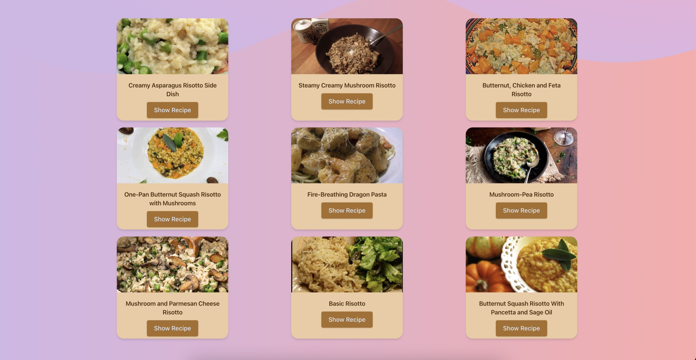

# RUPlatePal
## Inspiration
These season has been particularly rough for the less fortunate. The looming recession and recent economic downturn has led to many needing to rely on food pantry's for hot meals and food security. We wanted to help these people in need by creating a software application that would help maximize the amount of meals for these individuals

## What it does
Ever wonder what happens to the leftovers at Rutgers? RUPlatePal serves as the bridge between the dining hall and food pantries by optimizing the resources and generating instructions! RUPlatePal is B2B solution that helps those in need by allowing food pantry's to optimally manage their food and leftover food from the dining halls

## How we built it
We utilized Python for the backend/API work and used React/typescript/tailwindcss for the frontend. The backend pulls data from the google sheets API which would contain dining hall leftover food information and from there it calls the Spoonacular API to get recipe information based on the ingredients available. After that the frontend is constructed using this information (in JSON) and is displayed on a beautiful website.

## Challenges we ran into
Integrating Google Sheet API in the beginning took us quite a bit of time as well as getting the parallax/color scheme to work. We were also having slight issues with version control but we solved those issues quite quickly

## Accomplishments that we're proud of
Some of the best things we are proud of are some of the smallest things we appreciate. We were able to implement the Spoonacular API quite early on and utilize it to its fullest by getting recipes available and recipe information based on ingredients. We also were very proud of the parallax in the website and how the website looked visually

## What we learned
We learned how to implement and use SVG and how IDs take priority over classes in React websites. We also learned to connect multiple APIs together in a seamless manner

## What's next for RUPlatePal
We definitely plan on making the site dynamically update with new information which would ideally be from sensors in the dining hall itself. These sensors would automatically upload whatever food is leftover so the Food Pantry would know what to expect automatically

